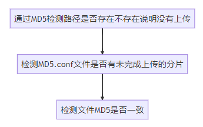

# 1 Video Stream
一般而言，采用浏览器下载会发现，假如途中网络延迟、网络中断等原因导致下载中断了。

这时浏览器会把缓存清空，而不会保存缓存文件，导致需要全部重新下载。

上图显示，在没有传输文件之前，堆内存占用非常小。


上图，由于直接读取整个视频文件到内存中，所以堆内存占用急剧上升。堆的内存急剧上升，峰值达到了6Gb,


## 改进

### 解决视频播放器传输大尺寸视频消耗过多资源

流式传输


上图为直接请求视频文件的播放器堆占用。


采用流式传输消耗很小。


## 上传和下载文件的问题
下载文件时，貌似不能采用206状态相应码，让浏览器自动去请求剩余部分，经过测试，迅雷下载器可以使用流传输
内容，传输部分内容。

浏览器只能传输整个大文件。

### 切片上传

后端：
[FragmentController.java](src/main/java/com/song/videostream/videoUpload/FragmentController.java)

- MD5.conf每一次检测文件不存在里创建个空文件，使用byte[] bytes = new byte[totalNumber];
将每一位状态设置为0，从0位天始，第N位表示第N个分片的上传状态，0-未上传 1-已上传，
当每将上传成功后使用randomAccessConfFile.seek(chunkNumber)将对就设置为1。

- randomAccessFile.seek(chunkNumber * chunkSize);可以将光标移到文件指定位置开始写数据，每一个文件每将上传分片编号chunkNumber都是不一样的，
所以各自写自己文件块，多线程写同一个文件不会出现线程安全问题。

- 大文件写入时用RandomAccessFile可能比较慢，可以使用MappedByteBuffer内存映射来加速大文件写入，
不过使用MappedByteBuffer如果要删除文件可能会存在删除不掉，因为删除了磁盘上的文件，
内存的文件还是存在的。

前端：
[videoFragmentUpload.html](src/main/resources/templates/videoFragmentUpload.html)


检查文件完整性：/checkFile接口设计思路



### 断点续传


实现断点续传，检查文件端点，续传断点文件。
```js
const checkFile = () => {
        var xhr = new XMLHttpRequest();
        // 当上传完成时调用
        xhr.onload = function () {
            if (xhr.status !== 200) {
                checkFileRes.innerHTML = '检测文件完整性失败:' + xhr.responseText;
            }
            checkFileRes.innerHTML = '检测文件完整性成功:' + xhr.responseText;
            //检查是否有分片上传失败
            let parse = JSON.parse(xhr.responseText);
            if (parse['chunks'] === undefined) return;

            let chunks = parse['chunks'];
            //遍历返回的标识
            for (let i = 0; i < chunks.length; i++) {
                console.info(chunks[i])
                //需要重新上传
                if (chunks[i] === '0') {
                    //创建formdata对象
                    let data = new FormData();
                    data.append("totalNumber", fileArr.length);
                    data.append("chunkSize", chunkSize);
                    data.append("chunkNumber", i)
                    data.append("md5", fileMd5);
                    data.append("file", new File([fileArr[i]], filename));
                    upload(data);
                }
            }
        }

        xhr.onerror = function () {
            checkFileRes.innerHTML = '检测文件完整性失败';
        }

        // 发送请求
        xhr.open('POST', 'fragment/checkFile', true);
        let data = new FormData();
        data.append("md5", fileMd5)
        xhr.send(data);
    }
```
当前，后台上传，读取的文件是否需要持久化保存到下一次用户发现上传失败，再次实现续传。

### 秒传

秒传也是比较简单的，只要修改前端代码流程就好了，比如张三上传了一个文件，然后李四又上传了同样内容的文件，
同一文件的MD5值可以认为是一样的（虽然会存在不同文件的MD5一样，不过概率很小，可以认为MD5一样文件就是一样），
10万不同文件MD5相同概率为110000000000000000000000000000\frac{1}{10000000000000000000000000000}100000000000000000000000000001，
福利彩票的中头奖的概率一般为 11000000\frac{1}{1000000}10000001，具体计算方法可以参考走近消息摘要--Md5产生重复的概率，
所以MD5冲突的概率可以忽略不计。

当李四调用/checkFile接口后，后端直接返回了李四上传的文件路径，李四就完成了秒传。大部分云盘秒传的思路应该也是这样，
只不过计算文件HASH算法更为复杂，返回给用户文件路径也更为安全，要防止被别人算出文件路径了。


### 切片下载
[videoFragmentDownload.html](src/main/resources/templates/videoFragmentDownload.html)
[FragmentController.java](src%2Fmain%2Fjava%2Fcom%2Fsong%2Fvideostream%2FvideoUpload%2FFragmentController.java)

浏览器的默认下载行为不会自动使用分片下载，因为标准的下载操作不涉及多次请求来获取文件的不同部分。要实现分片下载，
需要借助JavaScript来控制下载过程，或者利用下载管理工具。以下是一些原因和解决方法：
原因
- 默认下载行为：浏览器默认下载行为是直接发起一次完整的文件请求，而不是分块请求。
- 服务器支持：服务器必须支持Range头字段和返回206 Partial Content状态码。如果服务器不支持断点续传，浏览器无法实现分片下载。
- 浏览器限制：即使服务器支持，浏览器默认的下载机制通常不使用分片下载，因为这是一个同步的全文件下载请求。

1. 使用分片下载： 将大文件分割成多个小块进行下载，可以降低内存占用和网络传输中断的风险。这样可以避免一次性下载整个大文件造成的性能问题。

2. 断点续传： 实现断点续传功能，即在下载中途中断后，可以从已下载的部分继续下载，而不需要重新下载整个文件。

3. 进度条显示： 在页面上展示下载进度，让用户清晰地看到文件下载的进度。

4. 取消下载和暂停下载功能： 提供取消下载和暂停下载的按钮，让用户可以根据需要中止或暂停下载过程。

5. 合并文件： 下载完成后，将所有分片文件合并成一个完整的文件。

切片下载只能用于有缓存的下载器实现，对于没有缓存的下载器实现不了。采用js实现。
